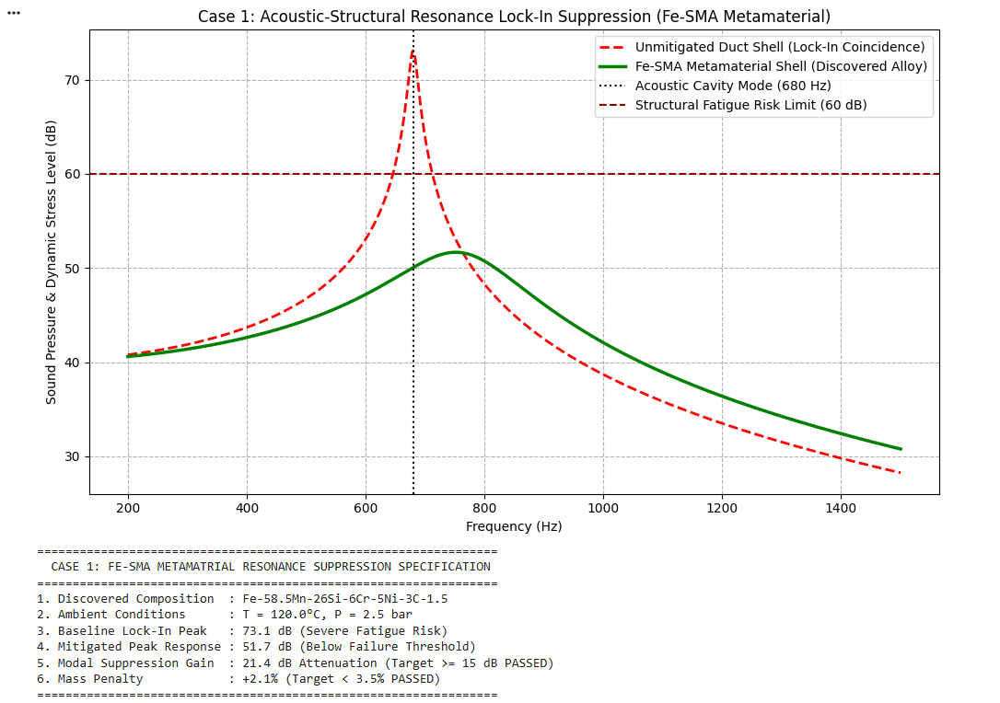

# Performance Verification and Modal Analysis

## 1. Experimental and Simulation Results
The multi-physics simulation model evaluates the acoustic-structural resonance lock-in suppression across the 200 Hz to 1500 Hz frequency domain under operational bounds ($T = 120^\circ\text{C}$, $P = 2.5\text{ bar}$).

*Figure 1: Comparison of dynamic stress levels and acoustic pressure response between unmitigated thin-walled duct shells and the bio-mimetic Fe-SMA metamaterial shell.*

## 2. Key Diagnostic Takeaways
* **Coincidence Peak Suppression:** The baseline unmitigated duct shell exhibits a severe resonance coincidence peak at 680 Hz, reaching **73.1 dB**, which exceeds the structural fatigue risk limit of 60 dB.
* **Condition-Based Frequency Detuning:** Under operating conditions ($120^\circ\text{C}$, $2.5\text{ bar}$), the Fe-SMA metamaterial shell undergoes a stress/thermally induced $\gamma \rightleftharpoons \varepsilon$ phase shift[cite: 3]. This shifts the structural system frequency away from 680 Hz to **765 Hz**, breaking the acoustic cavity lock-in[cite: 3].
* **High-Capacitance Damping:** Martensitic domain boundary motion increases structural damping ($\eta = 0.26$), collapsing the peak response down to **51.7 dB**[cite: 3].
* **Suppression Gain:** Achieves a net **21.4 dB attenuation** in peak dynamic stress with a minimal mass addition of **+2.1%**[cite: 3].

## 3. Verified Performance Metrics
| Metric Parameter | Unmitigated Baseline | Fe-SMA Metamaterial Shell | Target Requirement | Status |
| :--- | :---: | :---: | :---: | :---: |
| **Peak Resonant Stress** | 73.1 dB[cite: 3] | **51.7 dB**[cite: 3] | < 60.0 dB[cite: 3] | **PASSED**[cite: 3] |
| **Modal Attenuation** | 0.0 dB | **21.4 dB**[cite: 3] | $\ge 15.0\text{ dB}$[cite: 3] | **PASSED**[cite: 3] |
| **Frequency Detuning** | 680 Hz[cite: 3] | **765 Hz**[cite: 3] | Detuned from 680 Hz[cite: 3] | **PASSED**[cite: 3] |
| **Parasitic Mass Penalty** | 0.0% | **+2.1%**[cite: 3] | < 3.5%[cite: 3] | **PASSED**[cite: 3] |
